# WeatherPy & VacationPy

WeatherPy and VacationPy are two related projects that analyze weather data across the world's cities and help users plan their vacations based on specific weather conditions.

## WeatherPy

### Overview
WeatherPy is a Python script that visualizes the weather of 500+ cities across the world at varying distances from the equator. It utilizes the OpenWeatherMap API to retrieve weather information and leverages Pandas, Matplotlib, and other libraries to create scatter plots that showcase relationships between weather variables such as temperature, humidity, cloudiness, and wind speed.

### Features
- Collects data from the OpenWeatherMap API for over 500 cities.
- Creates scatter plots to analyze the relationship between various weather attributes.
- Determines the correlation between latitude and weather phenomena.
- Saves both the data and the scatter plots for further analysis.

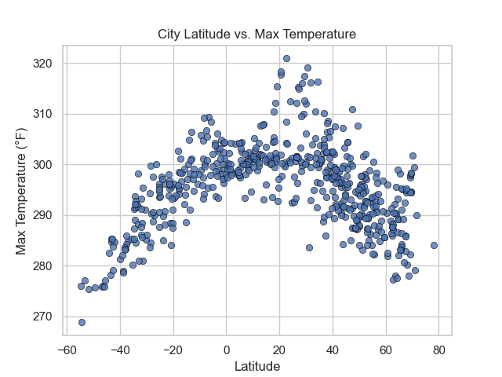

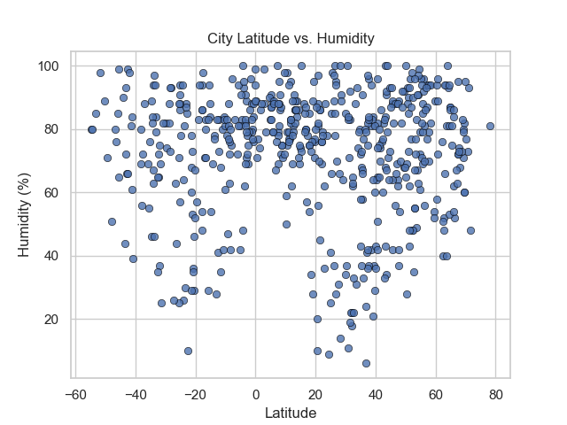

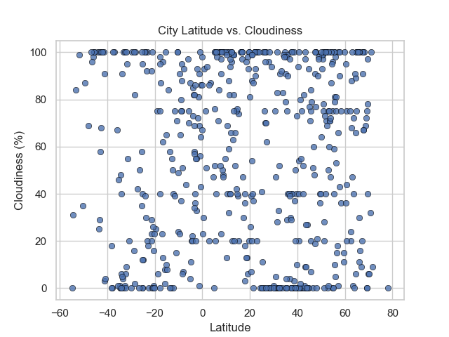

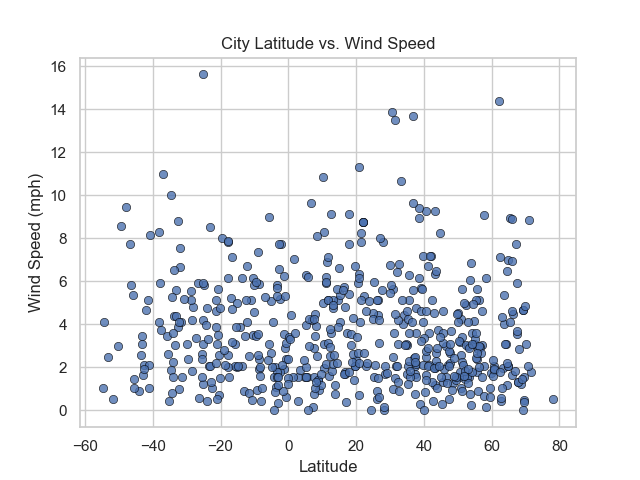

## Weather Relations Analysis

| Relation             | Northern Hemisphere                      | Southern Hemisphere                      |
|----------------------|-----------------------------------------|-----------------------------------------|
| Latitude vs max temp | Slope: -0.233, Intercept: 305.64, R: -0.591, P: 2.16e-38, SE: 0.016 | Slope: 0.494, Intercept: 303.72, R: 0.847, P: 7.17e-48, SE: 0.024 |
| Latitude vs humidity | Slope: -0.049, Intercept: 68.47, R: -0.041, P: 0.42, SE: 0.061    | Slope: -0.186, Intercept: 64.71, R: -0.120, P: 0.12, SE: 0.118    |
| Latitude vs cloudiness | Slope: -0.038, Intercept: 57.30, R: -0.019, P: 0.71, SE: 0.104  | Slope: -0.165, Intercept: 47.22, R: -0.057, P: 0.46, SE: 0.222    |
| Latitude vs windspeed | Slope: -0.011, Intercept: 4.23, R: -0.093, P: 0.066, SE: 0.006   | Slope: -0.023, Intercept: 3.41, R: -0.130, P: 0.091, SE: 0.014    |

### Latitude vs Max Temp Summary

The latitude vs max temperature relation shows a negative correlation in the Northern Hemisphere, meaning that the temperature decreases as latitude increases. In contrast, the Southern Hemisphere displays a positive correlation, where temperature increases with latitude. The distinct patterns between the hemispheres highlight different seasonal variations and solar energy distribution.

### Latitude vs Humidity Summary

For both the Northern and Southern Hemispheres, there is a weak negative correlation between latitude and humidity. The similar trend in both hemispheres might indicate a generalized climatic pattern, but the weak correlation suggests that other factors may have a more substantial influence on humidity.

### Latitude vs Cloudiness Summary

The latitude vs cloudiness relation reveals a very weak negative correlation in both hemispheres. This might suggest that latitude has a minimal direct impact on cloudiness. The similarity in both hemispheres further emphasizes the possible presence of other dominant factors affecting cloudiness.

### Figures
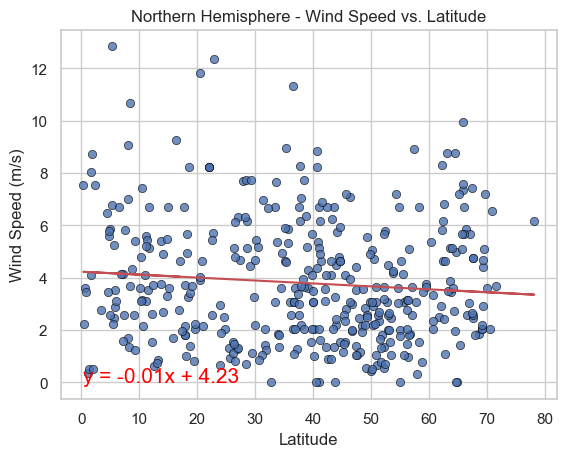
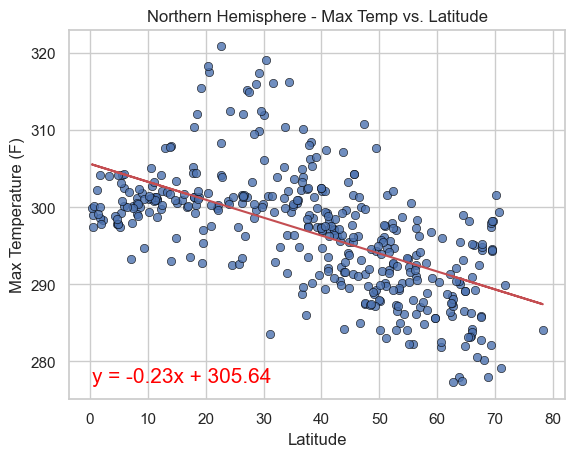

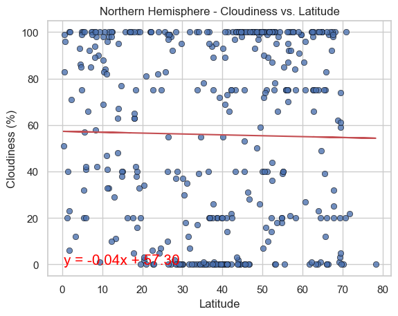
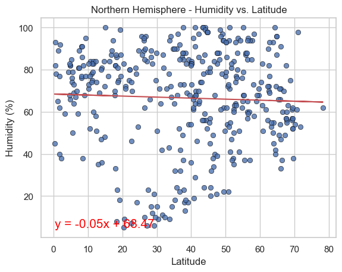
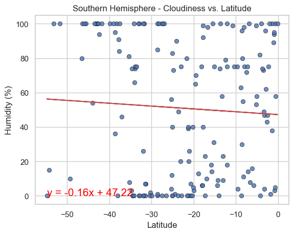
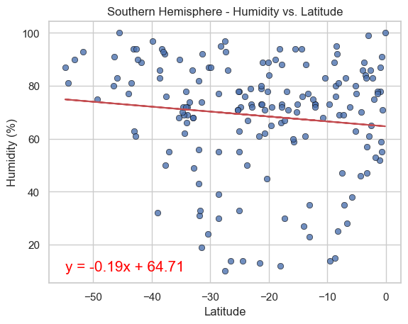
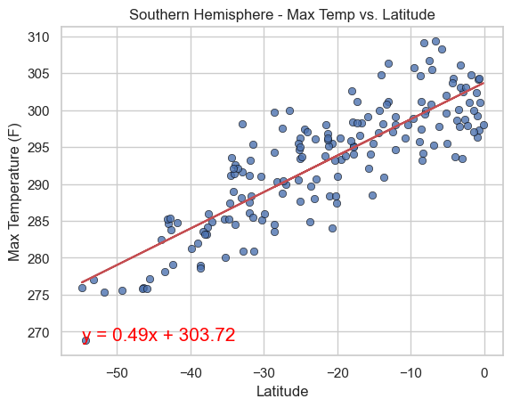
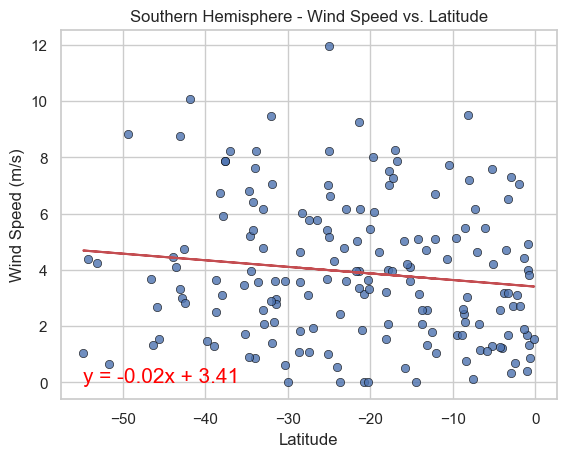

### Latitude vs Windspeed Summary

Latitude vs wind speed shows a weak negative correlation in both the Northern and Southern Hemispheres. This may suggest that the wind speed slightly decreases with increasing latitude. However, the weak correlation and slight differences between the hemispheres imply that latitude is not a major factor in determining wind speed, and other geographical or meteorological elements likely play a more significant role.
